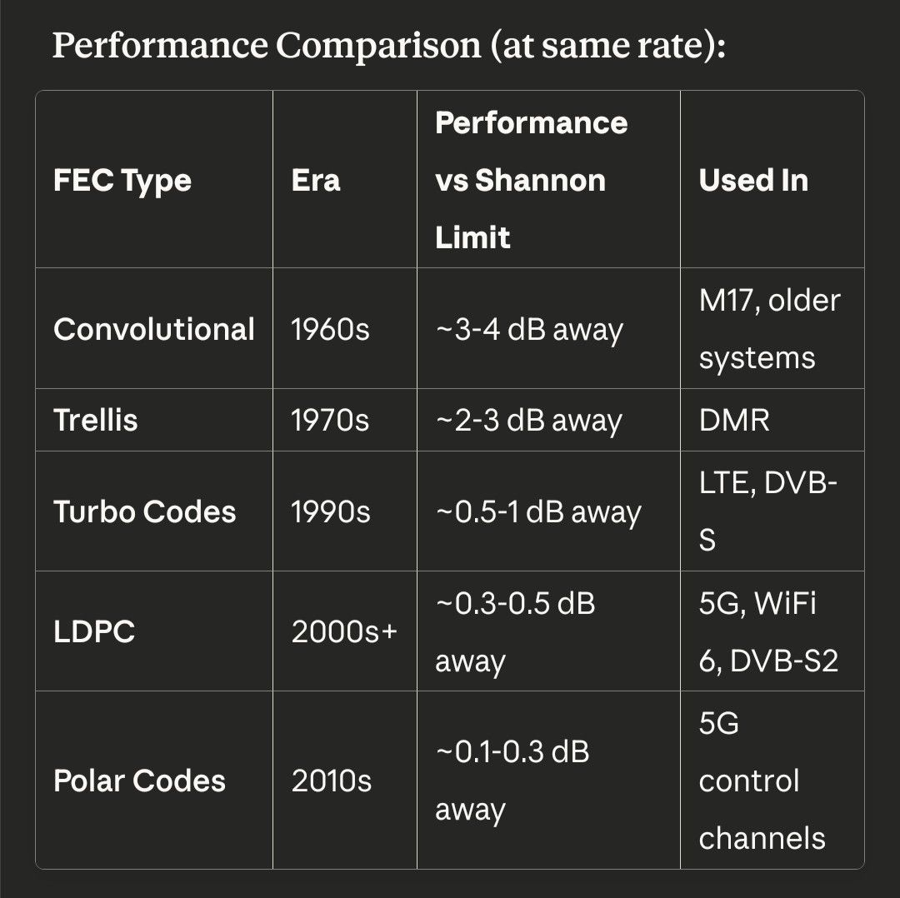

# gr-sleipnir

A Experimental GNU Radio-based digital voice mode designed for amateur radio narrowband FM (NFM) channel spacing, utilizing modern audio codecs for superior voice quality compared to traditional codec2 implementations.

## Table of Contents

- [About the Name](#about-the-name)
- [Overview](#overview)
- [Key Features](#key-features)
- [Cryptography](#cryptography-brainpoolp256r1--chacha20poly1305-optional)
- [Why Opus Over Codec2?](#why-opus-over-codec2)
- [System Architecture](#system-architecture)
- [Technical Specifications](#technical-specifications)
- [Performance](#performance)
- [Requirements](#requirements)
- [Installation](#installation)
  - [1. Install System Dependencies](#1-install-system-dependencies)
  - [2. Build and Install gr-opus Module](#2-build-and-install-gr-opus-module)
  - [3. Build and Install gr-sleipnir](#3-build-and-install-gr-sleipnir)
  - [4. Verify Installation](#4-verify-installation)
- [Usage](#usage)
- [Project Structure](#project-structure)
- [Documentation](#documentation)
  - [Superframe System](#superframe-system)
  - [TX/RX Modules](#txrx-modules)
  - [PTT Control](#ptt-control)
  - [LDPC Matrices](#ldpc-matrices)
  - [Testing](#testing)
  - [Examples](#examples)
- [Testing](#testing-1)
- [Status](#status)
- [Future Work](#future-work)
- [License](#license)
- [Contributing](#contributing)
- [Legal and Appropriate Uses](#legal-and-appropriate-uses-for-amateur-radio)
- [References](#references)

## About the Name

Sleipnir is the eight-legged horse of Odin, the Allfather in Norse mythology. According to the Prose Edda, Sleipnir was the finest of all horses, capable of traveling between the worlds of the gods, giants, and the dead. The name reflects the project's dual nature:

- **Eight legs**: Representing the 8FSK modulation mode (and the 4FSK mode as half the capability)
- **Speed and reliability**: Sleipnir's legendary speed and ability to traverse difficult terrain mirrors the system's goal of providing fast, reliable digital voice communication
- **Connection between worlds**: Just as Sleipnir bridged the realms of Norse cosmology, this system bridges the gap between traditional ham radio and modern digital communication technology

The name embodies the project's ambition to be a superior mode of digital voice communication for amateur radio, carrying messages reliably across the airwaves.

## Overview

gr-sleipnir is an experimental digital voice communication system for ham radio that combines Frequency Shift Keying (4FSK and 8FSK) modulation with modern audio codec technology. The system is designed to fit within standard NFM channel spacing while providing significantly improved audio quality over older codec2-based systems. Two modes are supported: 4FSK for standard operation and 8FSK for enhanced quality.

## Key Features

- **Dual Modulation Modes**: 4FSK (9,600 bps) and 8FSK (14,400 bps) for different quality/performance trade-offs
- **Modern Audio Codec**: Uses Opus codec (via gr-opus module) for superior voice quality
- **Forward Error Correction**: LDPC coding (rate 3/4 for 4FSK, rate 2/3 for 8FSK) for robust communication
- **NFM Channel Spacing**: Designed to operate within standard narrowband FM channel allocations
- **Integrated Services**: Voice, text messaging, callsign metadata, and framing in a single protocol
- **PTT Control**: Push-to-talk control integration for radio operation
- **GNU Radio Integration**: Built on GNU Radio framework for flexibility and extensibility
- **Optional Cryptography**: BrainpoolP256r1 + ChaCha20Poly1305 optimized for low-power devices (optional features)

## Cryptography: BrainpoolP256r1 + ChaCha20Poly1305 (Optional)

The system optionally supports a combination of BrainpoolP256r1 (from [gr-linux-crypto](https://github.com/Supermagnum/gr-linux-crypto)) and ChaCha20Poly1305 (from gr-nacl) for authentication and message integrity. This combination is specifically chosen for its battery-friendly characteristics. **Note: Encryption and signing are optional features** - the system can operate without cryptographic features for basic voice communication.

### Why This Combination is Battery-Friendly

#### 1. ChaCha20Poly1305 (from gr-nacl)

- **Software-optimized**: Designed for efficient software implementation without requiring special hardware instructions
- **ARM-friendly**: Provides excellent performance on ARM processors (common in battery-powered devices)
- **No hardware dependency**: Unlike AES, which benefits from AES-NI instructions (Intel/AMD), ChaCha20 works efficiently in pure software
- **Lower power consumption**: Software implementations consume less power than hardware-accelerated instructions that require specialized CPU features
- **High throughput**: Even without hardware acceleration, ChaCha20 achieves high encryption speeds

#### 2. BrainpoolP256r1 (from gr-linux-crypto)

- **Lightweight ECC**: Smaller key sizes compared to RSA (256 bits vs. 2048+ bits for equivalent security)
- **Efficient key exchange**: ECDH operations are computationally efficient
- **Battery-conscious**: Fewer CPU cycles = less power consumption during key exchange operations

## Why Opus Over Codec2?

Codec2 is a low-bitrate speech codec released in 2010, optimized for very low bandwidth (typically 1200-3200 bps). While effective for its era, codec2 has limitations:

- **Limited Audio Quality**: Designed for intelligibility over quality, resulting in robotic-sounding audio
- **Aging Technology**: Based on older speech coding techniques
- **Fixed Bitrates**: Limited flexibility in bitrate selection
- **Made for HF, not VHF bands**

Opus, standardized in 2012, represents a significant advancement:

- **Superior Quality**: Modern hybrid codec combining CELP and MDCT techniques
- **Adaptive Bitrate**: Supports bitrates from 6 kbps to 510 kbps with excellent quality at low rates
- **Low Latency**: Configurable frame sizes (2.5ms to 60ms) suitable for real-time communication
- **Robust Error Handling**: Better performance under adverse channel conditions
- **Wide Industry Adoption**: Used in modern VoIP, streaming, and communication systems

At comparable bitrates (e.g., 6-8 kbps), Opus provides noticeably better audio quality than codec2 while maintaining low latency suitable for ham radio applications.

## System Architecture

The system consists of two main components:

### 1. 4FSK Opus Transceiver Flowgraphs

The system includes separate transmitter and receiver flowgraphs:

**Transmitter (`tx_4fsk_opus.grc`)**:
- WAV file source for audio input
- Low-pass filter for audio preprocessing
- Opus audio encoder (6 kbps)
- LDPC forward error correction (rate 3/4)
- 4FSK symbol mapping and modulation
- Root raised cosine pulse shaping
- Frequency modulation for RF transmission
- Complex baseband I/Q file output

**Receiver (`rx_4fsk_opus.grc`)**:
- Complex baseband I/Q file input
- Automatic gain control (AGC)
- Quadrature demodulation for FSK reception
- Root raised cosine matched filtering
- Symbol timing recovery (Mueller & Muller)
- 4FSK symbol slicing
- LDPC forward error correction decoding
- Opus audio decoder
- Low-pass filter for audio post-processing
- WAV file sink for audio output

### 2. gr-opus Module

The gr-opus module is a separate GNU Radio Out-of-Tree (OOT) module available at [https://github.com/Supermagnum/gr-opus](https://github.com/Supermagnum/gr-opus). It provides:
- Opus audio encoder block
- Opus audio decoder block
- Support for multiple sample rates (8kHz, 12kHz, 16kHz, 24kHz, 48kHz)
- Mono and stereo support
- Configurable bitrate and application profiles

## Technical Specifications

### Modulation Modes

The system supports two modulation modes optimized for different use cases:

#### 4FSK Mode (Standard)

- **Modulation**: 4-level Frequency Shift Keying
- **Symbol Rate**: 4800 symbols/second
- **Gross Capacity**: 9,600 bps
- **FSK Deviation**: 2400 Hz
- **RF Sample Rate**: 48 kHz (10 samples per symbol)
- **Audio Sample Rate**: 8 kHz
- **Bandwidth**: ~9-10 kHz
- **SNR Requirement**: Baseline

**Bitrate Budget Breakdown**:
- Opus voice (raw): 6,000 bps
- LDPC rate 3/4 coded: 8,000 bps
- Framing/sync: 800 bps
- Metadata/callsign: 400 bps
- Text messaging: 400 bps (burst mode)
- **Total**: 9,600 bps

**Characteristics**:
- Voice quality: Good (6 kbps Opus)
- FEC strength: Moderate (rate 3/4)
- Suitable for standard NFM channel spacing

#### 8FSK Mode (High Performance)

- **Modulation**: 8-level Frequency Shift Keying
- **Symbol Rate**: 4800 symbols/second
- **Gross Capacity**: 14,400 bps
- **Bandwidth**: ~11-12 kHz
- **SNR Requirement**: +3 dB vs 4FSK

**Bitrate Budget Breakdown**:
- Opus voice (raw): 8,000 bps
- LDPC rate 2/3 coded: 12,000 bps
- Framing/sync: 800 bps
- Callsign/meta: 600 bps
- Text messaging: 600 bps (burst mode)
- CRC/checksum: 200 bps
- Reserved: 200 bps
- **Total**: 14,400 bps

**Characteristics**:
- Voice quality: Excellent (8 kbps Opus)
- FEC strength: Strong (rate 2/3)
- Requires better SNR but provides superior audio quality

### General Specifications

- **Codec**: Opus (via gr-opus module)
- **Channel Spacing**: Compatible with standard NFM spacing (typically 12.5 kHz or 25 kHz)
- **PTT Control**: Optional ZeroMQ message-based control

## Performance

The following graph shows the performance of the system in dB versus the Shannon limit:



## Requirements

### System Dependencies

- GNU Radio 3.8 or later
- libopus-dev (Opus codec development libraries)
- CMake 3.8 or later
- ZeroMQ libraries (optional, for PTT control and I/Q streaming)

### GNU Radio Out-of-Tree (OOT) Modules

gr-sleipnir requires the following GNU Radio OOT modules:

- **[gr-opus](https://github.com/Supermagnum/gr-opus)** - Opus audio codec support
- **[gr-linux-crypto](https://github.com/Supermagnum/gr-linux-crypto)** - Linux crypto infrastructure integration (optional, for BrainpoolP256r1 ECDSA)
- **[gr-openssl](https://github.com/gnuradio/gr-openssl)** - OpenSSL integration (optional, for additional crypto operations)
- **[gr-nacl](https://github.com/gnuradio/gr-nacl)** - NaCl/ChaCha20-Poly1305 support (optional, for authenticated encryption)

**Note**: Cryptographic features are optional. The system can operate without these modules for basic voice communication.

### Python Dependencies

- numpy
- cryptography (for ECDSA signatures and ChaCha20-Poly1305 MAC when gr-linux-crypto/gr-nacl unavailable)

### Installation

#### 1. Install System Dependencies

```bash
# Install system dependencies (Ubuntu/Debian)
sudo apt-get install gnuradio-dev libopus-dev cmake python3-dev

# Optional: Install ZeroMQ for PTT control and I/Q streaming
sudo apt-get install libzmq3-dev

# Install Python dependencies
pip3 install numpy cryptography --break-system-packages
```

#### 2. Build and Install Required GNU Radio OOT Modules

gr-sleipnir requires several GNU Radio OOT modules:

**gr-opus (Required)**:
```bash
# Clone and build gr-opus
git clone https://github.com/Supermagnum/gr-opus.git
cd gr-opus
mkdir build && cd build
cmake ..
make
sudo make install
sudo ldconfig
cd ../..
```

**gr-linux-crypto (Optional, for BrainpoolP256r1 ECDSA)**:
```bash
# Clone and build gr-linux-crypto
git clone https://github.com/Supermagnum/gr-linux-crypto.git
cd gr-linux-crypto
mkdir build && cd build
cmake ..
make
sudo make install
sudo ldconfig
cd ../..
```

**gr-openssl (Optional, for additional crypto operations)**:
```bash
# Clone and build gr-openssl
git clone https://github.com/gnuradio/gr-openssl.git
cd gr-openssl
mkdir build && cd build
cmake ..
make
sudo make install
sudo ldconfig
cd ../..
```

**gr-nacl (Optional, for ChaCha20-Poly1305)**:
```bash
# Clone and build gr-nacl
git clone https://github.com/gnuradio/gr-nacl.git
cd gr-nacl
mkdir build && cd build
cmake ..
make
sudo make install
sudo ldconfig
cd ../..
```

**Note**: Only gr-opus is required for basic voice communication. The crypto modules are optional and used when cryptographic features are enabled.

#### 3. Build and Install gr-sleipnir

```bash
# Clone the repository
git clone https://github.com/Supermagnum/gr-sleipnir.git
cd gr-sleipnir

# Create build directory
mkdir build && cd build

# Configure with CMake
cmake ..

# Build (validates Python syntax)
make

# Optional: Validate Python files
make check_python

# Install the module
# Use absolute path to avoid sudo working directory issues
sudo make -C $(pwd)/build install

# Update library cache
sudo ldconfig
```

**Note**: gr-sleipnir is a Python-only GNU Radio module, so `make` doesn't compile any C/C++ code. It validates the build configuration and Python syntax. The actual installation happens with `make install`.

#### 4. Verify Installation

After installation, verify that the module can be imported:

```bash
python3 -c "import sleipnir; print('gr-sleipnir installed successfully')"
```

If you encounter import errors, check that the Python modules are installed in the correct location:

```bash
python3 -c "import gnuradio; import os; print(os.path.dirname(gnuradio.__file__))"
```

The sleipnir module should be installed in `gnuradio/sleipnir/` within that directory.

#### Troubleshooting Installation

**Issue: "getcwd: Fila eller mappa finnes ikke" when using sudo**

This error occurs when `sudo` loses the current working directory context. **Solution: Use absolute path with `-C` flag:**

```bash
# From project root directory
sudo make -C $(pwd)/build install

# Or with explicit absolute path
sudo make -C /home/haaken/github-projects/gr-sleipnir/build install
```

**Alternative: Test installation without sudo (using DESTDIR):**
```bash
cd build
make install DESTDIR=/tmp/gr-sleipnir-install
# Then manually copy files if needed
```

**Issue: Module not found after installation**

- Verify installation location: `python3 -c "import gnuradio; import os; print(os.path.dirname(gnuradio.__file__))"`
- Check that files exist: `ls -la /usr/lib/python3/dist-packages/gnuradio/sleipnir/`
- Ensure Python can find the module: `python3 -c "import sys; print(sys.path)"`

## Usage

### Running the Flowgraphs

**Transmitter**:
Open the transmitter flowgraph in GNU Radio Companion:

```bash
cd examples
gnuradio-companion tx_4fsk_opus.grc
```

Or run the generated Python script directly:

```bash
cd examples
grcc tx_4fsk_opus.grc
python3 tx_4fsk_opus.py
```

**Receiver**:
Open the receiver flowgraph in GNU Radio Companion:

```bash
cd examples
gnuradio-companion rx_4fsk_opus.grc
```

Or run the generated Python script directly:

```bash
cd examples
grcc rx_4fsk_opus.grc
python3 rx_4fsk_opus.py
```

### Configuration

Key parameters can be adjusted in the flowgraphs:
- `audio_samp_rate`: Audio sample rate (default: 8000 Hz)
- `rf_samp_rate`: RF sample rate (default: 48000 Hz)
- `symbol_rate`: Symbol rate (default: 4800 symbols/second)
- `fsk_deviation`: FSK deviation in Hz (default: 2400)
- `ldpc_matrix_file`: Path to LDPC matrix file (default: `../ldpc_matrices/ldpc_rate34.alist`)

### File-Based Testing

The flowgraphs are configured for file-based testing:
- **Transmitter**: Reads from `input.wav`, outputs to `tx_output.cfile`
- **Receiver**: Reads from `tx_output.cfile`, outputs to `output.wav`

To test the system:
1. Place a WAV file named `input.wav` in the `examples` directory
2. Run the transmitter flowgraph to generate `tx_output.cfile`
3. Run the receiver flowgraph to decode and generate `output.wav`
4. Compare `input.wav` and `output.wav` to verify audio quality

## Project Structure

```
gr-sleipnir/
├── README.md                      # This file
├── CMakeLists.txt                 # Root CMake configuration
├── SUPERFRAME_IMPLEMENTATION.md   # Superframe implementation guide
├── TEST_RESULTS.md                # Latest test execution results
├── examples/                      # Example flowgraphs and documentation
│   ├── sleipnir_tx_basic.grc     # Basic TX example
│   ├── sleipnir_rx_basic.grc     # Basic RX example
│   ├── sleipnir_tx_encrypted.grc # TX with encryption/signing
│   ├── sleipnir_rx_verified.grc # RX with signature verification
│   ├── sleipnir_tx_ptt.grc       # TX with GPIO PTT control
│   ├── sleipnir_rx_zmq.grc       # RX with ZMQ output
│   ├── tx_4fsk_opus.grc          # 4FSK Opus transmitter (legacy)
│   ├── rx_4fsk_opus.grc          # 4FSK Opus receiver (legacy)
│   ├── tx_8fsk_opus.grc          # 8FSK Opus transmitter (legacy)
│   ├── rx_8fsk_opus.grc          # 8FSK Opus receiver (legacy)
│   ├── README_EXAMPLES.md        # Examples documentation
│   ├── SLEIPNIR_TX_MODULE.md     # TX module guide
│   ├── SLEIPNIR_RX_MODULE.md     # RX module guide
│   ├── SUPERFRAME_FLOWGRAPHS.md  # Superframe flowgraph guide
│   ├── SUPERFRAME_INTEGRATION.md # Superframe integration guide
│   └── PTT_METHODS.md            # PTT control methods guide
├── ldpc_matrices/                 # LDPC FEC matrix files
│   ├── ldpc_rate34.alist         # Rate 3/4 LDPC matrix (4FSK)
│   ├── ldpc_rate23.alist         # Rate 2/3 LDPC matrix (8FSK)
│   ├── ldpc_voice_576_384.alist  # Voice frame LDPC (rate 2/3)
│   ├── ldpc_auth_768_256.alist   # Auth frame LDPC (rate 1/3)
│   ├── README.md                  # LDPC matrices overview
│   ├── README_SUMMARY.md          # LDPC matrices summary
│   ├── SUPERFRAME_LDPC.md        # Superframe LDPC documentation
│   └── NOTE.md                    # Additional LDPC notes
├── python/                        # Python utilities and modules
│   ├── superframe_controller.py  # Superframe controller
│   ├── voice_frame_builder.py    # Voice frame builder
│   ├── crypto_helpers.py          # Cryptographic helpers
│   ├── sleipnir_tx_hier.py       # TX hierarchical block
│   ├── sleipnir_rx_hier.py       # RX hierarchical block
│   ├── sleipnir_superframe_assembler.py  # Superframe assembler
│   ├── sleipnir_superframe_parser.py     # Superframe parser
│   ├── ptt_gpio.py               # GPIO PTT control
│   ├── ptt_serial.py             # Serial PTT control
│   ├── ptt_vox.py                # VOX PTT control
│   ├── ptt_network.py            # Network PTT control
│   ├── ptt_control_integration.py # PTT integration helper
│   ├── zmq_control_helper.py     # ZMQ control helper
│   ├── zmq_status_output.py      # ZMQ status output
│   ├── frame_aware_ldpc.py       # Frame-aware LDPC encoder/decoder
│   ├── README_SUPERFRAME.md      # Superframe Python API
│   ├── README_TX_MODULE.md       # TX module quick reference
│   └── README_RX_MODULE.md       # RX module quick reference
├── tests/                        # Test suite
│   ├── README.md                 # Test suite documentation
│   ├── TEST_SCENARIOS.md         # Test scenarios documentation
│   ├── TEST_SUMMARY.md           # Test summary
│   ├── INTEGRATION_TESTS.md      # Integration test guide
│   ├── run_all_tests.py          # Test runner
│   └── test_*.py                 # Individual test files
└── Pictures/                     # Images and graphics
    └── performance.jpg           # Performance graph

Note: gr-opus is a separate module available at https://github.com/Supermagnum/gr-opus
```

## Documentation

### Superframe System

- **[Superframe Implementation Guide](SUPERFRAME_IMPLEMENTATION.md)** - Complete guide to implementing and using the superframe transmission system
- **[Superframe Python API](python/README_SUPERFRAME.md)** - Python API documentation for superframe components
- **[Superframe Flowgraphs](examples/SUPERFRAME_FLOWGRAPHS.md)** - Guide for modifying and creating GRC flowgraphs for superframe transmission
- **[Superframe Integration](examples/SUPERFRAME_INTEGRATION.md)** - Integration guide for superframe system
- **[Superframe LDPC Matrices](ldpc_matrices/SUPERFRAME_LDPC.md)** - Documentation for LDPC matrices used in superframe system

### TX/RX Modules

- **[TX Module Documentation](python/README_TX_MODULE.md)** - Quick reference for the TX module
- **[TX Module Guide](examples/SLEIPNIR_TX_MODULE.md)** - Complete guide to the sleipnir_tx_hier module
- **[RX Module Documentation](python/README_RX_MODULE.md)** - Quick reference for the RX module
- **[RX Module Guide](examples/SLEIPNIR_RX_MODULE.md)** - Complete guide to the sleipnir_rx_hier module

### PTT Control

- **[PTT Methods Guide](examples/PTT_METHODS.md)** - Documentation for GPIO, Serial, VOX, and Network PTT control methods

### LDPC Matrices

- **[LDPC Matrices README](ldpc_matrices/README.md)** - Overview of LDPC parity check matrices
- **[LDPC Matrices Summary](ldpc_matrices/README_SUMMARY.md)** - Summary of available LDPC matrices
- **[LDPC Notes](ldpc_matrices/NOTE.md)** - Additional notes on LDPC matrices

### Testing

- **[Test Suite README](tests/README.md)** - Comprehensive test suite documentation
- **[Test Scenarios](tests/TEST_SCENARIOS.md)** - Detailed documentation of test scenarios
- **[Test Summary](tests/TEST_SUMMARY.md)** - Quick reference summary of test results
- **[Test Results](TEST_RESULTS.md)** - Latest test execution results
- **[Integration Tests](tests/INTEGRATION_TESTS.md)** - Guide for running integration tests

### Examples

Example flowgraphs demonstrating gr-sleipnir module usage:

- **[Examples Documentation](examples/README_EXAMPLES.md)** - Complete guide to example flowgraphs

**gr-sleipnir Module Examples:**
- `sleipnir_tx_basic.grc` - Basic TX example using sleipnir_tx_hier
- `sleipnir_rx_basic.grc` - Basic RX example using sleipnir_rx_hier
- `sleipnir_tx_encrypted.grc` - TX with encryption and signing
- `sleipnir_rx_verified.grc` - RX with signature verification
- `sleipnir_tx_ptt.grc` - TX with GPIO PTT control
- `sleipnir_rx_zmq.grc` - RX with ZMQ status output

**Legacy Examples (direct block usage):**
- `tx_4fsk_opus.grc` - 4FSK Opus transmitter (legacy)
- `rx_4fsk_opus.grc` - 4FSK Opus receiver (legacy)
- `tx_8fsk_opus.grc` - 8FSK Opus transmitter (legacy)
- `rx_8fsk_opus.grc` - 8FSK Opus receiver (legacy)

## Testing

The gr-opus module includes comprehensive tests. See the [gr-opus repository](https://github.com/Supermagnum/gr-opus) for testing instructions and detailed test results.

For gr-sleipnir specific tests, see the [Test Suite Documentation](tests/README.md).

## Status

This is an experimental project. The system is functional but may require tuning for optimal performance in various operating conditions.

## Future Work

- Real-time audio I/O integration (currently file-based)
- Performance testing and optimization under various channel conditions
- Enhanced error recovery and frame synchronization
- Additional modulation modes
- Integration with additional hardware platforms

## License

GPLv3

## Contributing

Contributions are welcome. Please ensure all code follows the project's coding standards and includes appropriate tests.

## Legal and Appropriate Uses for Amateur Radio

**Note**: The cryptographic features described below are **optional**. The system can operate without encryption or signing for basic voice communication.

### Digital Signatures (Optional Feature)

- **Cryptographically sign transmissions** to verify sender identity
- **Prevent callsign spoofing** through cryptographic authentication
- **Replace error-prone DTMF authentication** with secure digital signatures
- **Legal**: Digital signatures do not obscure content and are generally permitted in amateur radio

### Message Integrity

- **Detect transmission errors** through cryptographic integrity checks
- **Verify message authenticity** to ensure messages haven't been tampered with
- **Non-obscuring authentication tags** that verify but don't hide content
- **Legal**: Integrity verification does not hide message content

### Key Management Infrastructure

- **Secure key storage** using Nitrokey hardware security modules and kernel keyring
- **Off-air key exchange** using ECDH (Elliptic Curve Diffie-Hellman)
- **Authentication key distribution** for establishing trust relationships
- **Legal**: Key management does not encrypt on-air content

### Important Note

**Signing and verifying sender identity is NOT encryption**. Digital signatures provide authentication and integrity verification without obscuring the message content, making them appropriate for amateur radio use where encryption is generally prohibited.

### Experimental and Research Uses

For experiments or research on frequencies where encryption is legally permitted:

- Encryption may be used in accordance with local regulations
- Users must verify applicable frequency bands and regulations
- This module provides the technical capability; users are responsible for legal compliance

## References

- [Opus Codec](https://opus-codec.org/)
- [GNU Radio](https://www.gnuradio.org/)
- [Codec2](https://www.rowetel.com/?page_id=452)
- [gr-opus](https://github.com/Supermagnum/gr-opus) - Opus codec GNU Radio module
- [gr-linux-crypto](https://github.com/Supermagnum/gr-linux-crypto) - BrainpoolP256r1 and Linux crypto integration
